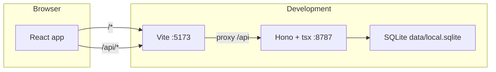
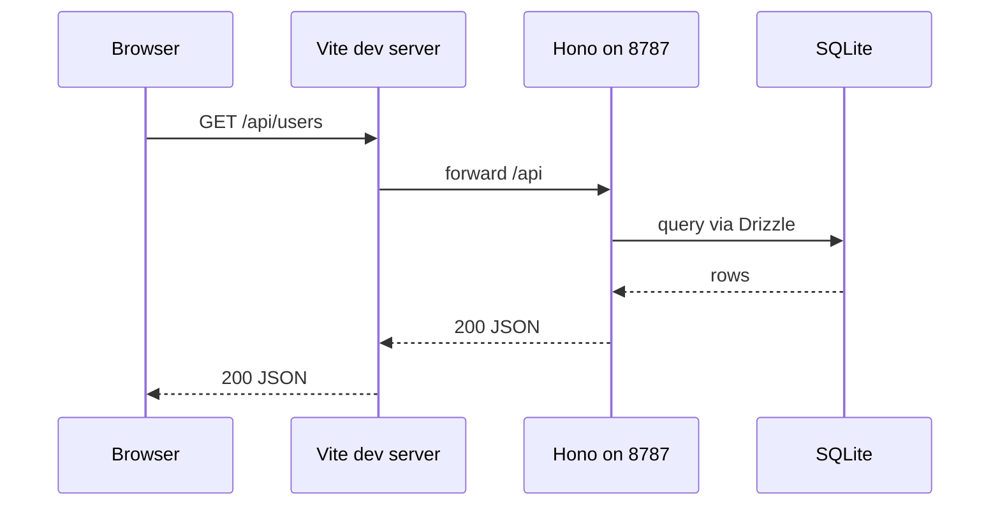
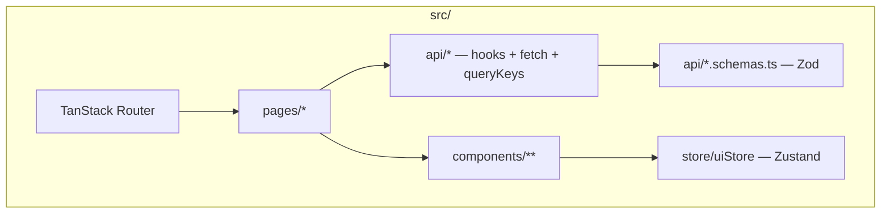
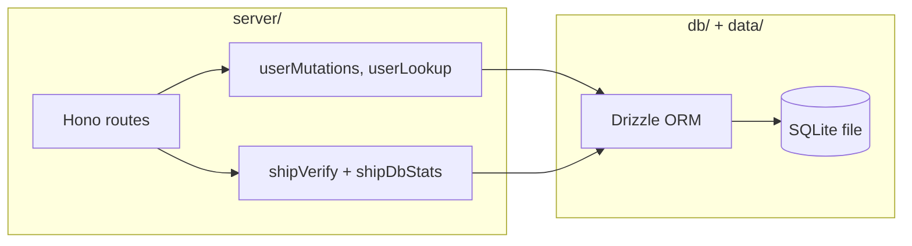

# agent-team-starter

React + Vite + TanStack Query + Zod + Hono + SQLite, with a shared **`.ai-rules/`** tree for agents (skills, commands, agents, MCP). See `CLAUDE.md` for **definition of done** and stack rules.

## New machine (0 → 1)

1. **Install** [Node.js 20+](https://nodejs.org) and [pnpm](https://pnpm.io/installation) (`corepack enable` then `corepack prepare pnpm@latest --activate` works on many setups).
2. **Clone and install**
   ```bash
   git clone <repo-url> && cd agent-team-starter
   pnpm install
   ```
   `postinstall` runs `scripts/ensure-ai-rules-symlinks.mjs` so **`.cursor/`** and **`.claude/`** point at **`.ai-rules/`**. If symlinks are missing (some Windows checkouts), run `pnpm run ai-rules:link`.
3. **Verify the toolchain** (same gate as CI: types, tests, lint, format, build, Fallow audit)
   ```bash
   pnpm verify
   ```
4. **Run the app** — API + Vite: `pnpm dev` (or `pnpm dev:ready` to wait for ports, then `pnpm dev:stop` when done). Default UI: [http://localhost:5173](http://localhost:5173); API: [http://127.0.0.1:8787](http://127.0.0.1:8787).
5. **Optional** — [GitHub CLI](https://cli.github.com) (`gh auth login` for PRs), Chrome DevTools MCP and Context7 in Cursor (see `.ai-rules/mcp.json` and **`.ai-rules/README.md`** for `CONTEXT7_API_KEY`), and any secrets in local-only files (e.g. **`.claude/settings.local.json`**, not committed).

## Architecture

This repo is a **single-package** TypeScript monolith: a **Vite SPA** talks to a **Node HTTP API** backed by **SQLite** via **Drizzle ORM**. API shapes are validated with **Zod** and shared between client and server where it keeps boundaries honest.

### Runtime topology

In development, two processes run: **Vite** (UI + dev middleware) and **tsx** (API). The browser calls `/api/*`; Vite **proxies** those requests to the API so the UI keeps same-origin `fetch("/api/...")` URLs.



With the default **dev** setup, **MSW** handles most `/api/*` in the browser (see **Client application** below), so traffic often never reaches the proxy or `:8787` until you disable mocks or call the API directly (for example `curl` to `http://127.0.0.1:8787`). **Production** builds do not start MSW; `fetch("/api/...")` goes to wherever the app is hosted, typically via the same reverse proxy as the API.

Production usage is typically **build the static client** (`pnpm build`) and **serve the API** (same Hono app) with the `dist/` assets hosted separately or behind a reverse proxy—not automated in this repo’s dev scripts.

When the browser issues `fetch("/api/...")` and the call is **not** intercepted by MSW, Vite proxies it to the API process:



### Client application

The UI is a **TanStack Router** tree under `src/router.ts`, with a root layout (`App` → `AppShell` → `<Outlet />`). **TanStack Query** owns server-backed data; **Zustand** is reserved for purely client UI state (for example theme in `src/store/uiStore.ts`), matching the “never both for the same data” rule in `CLAUDE.md`.



In **development**, **MSW** (`src/mocks/`) intercepts `/api/*` in the browser so the UI can run against deterministic fixtures; **production builds** do not start the mock worker (`src/main.tsx`).

### Server and data layer

The API lives in **`server/`**: a **Hono** app created in `server/index.ts`. On startup it runs **Drizzle migrations** from `drizzle/`, **seeds** an empty database from `db/seed-data.ts`, and exposes REST-style JSON endpoints (`GET/POST/PATCH/DELETE` for users, plus `GET /api/ship-verify` for health-style DB checks).

**`db/`** holds the **SQLite schema** (`db/schema.ts`), **`createDb`** (`db/client.ts` → `data/local.sqlite`, WAL mode), and seeds. **Drizzle Kit** drives `db:generate`, `db:migrate`, `db:push`, etc. (`drizzle.config.ts`).



### Shared API contracts

**Zod schemas** in `src/api/*.schemas.ts` define request/response shapes. Client hooks in `src/api/users.ts` parse JSON with these schemas; the server imports the same schemas where validation must stay aligned (for example ship-verify). This reduces drift between UI and API.

### Quality gates and tests

| Layer | How it is checked |
|--------|-------------------|
| Client | **Vitest** + RTL (`src/**/*.test.tsx`, coverage gates in `vite.config.ts`), **MSW** for API in tests |
| E2E | **Playwright** (`pnpm test:e2e`) |
| Repo health | **Biome** + **oxlint**, **Fallow** audit (`pnpm verify` runs `scripts/verify.sh`) |

Server-only and script code are exercised by targeted tests and manual **drizzle-db-verify** flows when DB/API behavior changes (`CLAUDE.md`).

### Repository layout

| Path | Role |
|------|------|
| `src/` | SPA: router, pages, UI, TanStack Query hooks, Zod schemas, mocks |
| `server/` | Hono app, request handlers, SQLite/Drizzle helpers |
| `db/` | Drizzle schema, DB factory, seed data |
| `drizzle/` | Generated SQL migrations |
| `data/` | Local SQLite file (gitignored) |
| `scripts/` | `verify`, dev helpers, tooling (e.g. patch-coverage) |
| `.ai-rules/` | Canonical AI rules, skills, commands, agents (`postinstall` symlinks `.cursor`/`.claude`) |

## AI workflow (short)

| Goal | Command |
|------|--------|
| Full pipeline (plan → critic → test critic → build → review) | In Claude Code: `/ship <spec>` |
| Smaller / fast path | `/ship-light <spec>` |
| Browser-only smoke | `/verify [path]` |

Details and tradeoffs: `.ai-rules/commands/ship.md`, `ship-light.md`, `verify.md`. Layout of skills/rules: **`.ai-rules/README.md`**.
